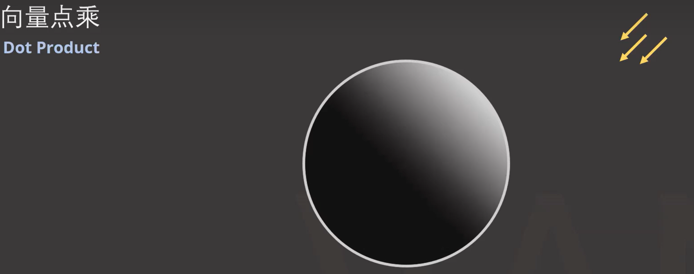

# 向量

## 向量的定义

在数学中，向量（也称为矢量），指具有大小和方向的量。它可以形象化地表示为带箭头的线段。

- 箭头所指：代表向量的方向

- 线段长度：代表向量的大小

其中向量的大小也被称为**向量的模**

**单位向量**指的是模为1的向量 

**向量归一化**指的是像任意向量变换成**单位向量**, 也就是只改变向量大小, 不改变向量的方向

上述的知识貌似是高中知识还是初中知识, 所以不做更进一步的说明

## 向量的点乘

向量点乘的几何意义: 计算的是两个向量的模的乘积再乘以两个向量夹角的cos值 

如果将这两个向量进行**向量归一化**,  那么计算出来的结果其实就是两个向量之间的夹角cos值  

点乘的性质:

### 图形学中的应用:

#### 应用1: 判断这两个向量是否是同一方向

余旋函数图

-    a·b>0   方向基本相同，夹角在0°到90°之间
-    a·b=0   正交，相互垂直  
-    a·b<0   方向基本相反，夹角在90°到180°之间 

####  应用2:平行光向量和物体表面法线向量的点乘

转换为RGB颜色, cos的值[-1,  1] 转换到[0, 1] , 再乘以256. 转换的算法就是

$$
(0.5 *con\theta + 0.5) * 256
$$

## 向量的叉乘

注意: 下面是右手系的叉乘( 坐标系也就是 x Cross y = z, ***大拇指指向*x*轴的正方向，食指指向*y*轴的正方向时，中指所指的方向就是*z*轴的正方向***)

叉乘代表的是同时垂直于a和b向量的一个向量

这个向量的大小是 a的模和 b 的模 以及两者夹角sin值的乘积

正旋函数图

这个向量的方向可以用右手系法则确认

叉乘的性质

### 图形学中的应用:

#### 应用1: 判断一个点是否在三角形内

- a1 向量 = AB Cross AP 

- a2 向量 = BC Cross BP

- a3 向量 = CA Cross CP

只需要计算 a1 dot a2  &&  a1 dot a3  &&  a2 dot a3 同时大于等于或者同时小于等于0 即可

## 向量变换和逆变换

变换矩阵的作用: 从几何上看,  是定义了新坐标系

将"我们坐标系"中的基向量 (1, 0)  (0, 1) 变换成"变换矩阵"中的(2, 1)  (-1, 1) 这两个坐标

并且将两个坐标定义为"新坐标系"的基向量(1, 0)  (0, 1)

把这个"新坐标系"中描述的向量转换到"我们坐标系"

$$
[x_j,  y_j]   --> [x_0, y_0]
$$

## 矩阵变换

其中M是"我们坐标系" 下的矩阵变化, V是"新坐标系"的向量

$$
(A^-) * M * A  * \vec{V}
$$
